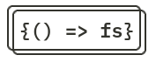

# full-stack-open-2021

[Full Stack Open](https://fullstackopen.com/en/) is an introductary course to modern web development with JavaScript. This repository contains my submission to different exercises.

## About the course

- The main focus is on single page applications implemented with `React` and supporting them with `RESTful` and `GraphQL` web services implemented with `Node.js`.

- Course has also parts on `TypeScript`, `React Native` and `continuous integration`.

- Other topics include `debugging` applications, `configuration`, managing `runtime environments` and `NoSQL` databases.

## Exercises

- [part0: Fundamentals of web apps](https://github.com/qingqingqingli/full-stack-open-2021/tree/main/part0)
- [part1: Introduction to React](https://github.com/qingqingqingli/full-stack-open-2021/tree/main/part1)
